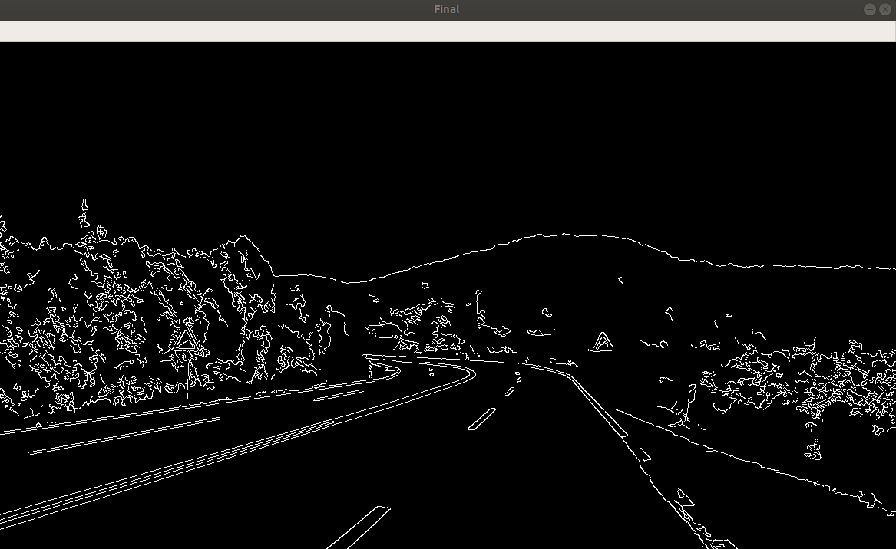
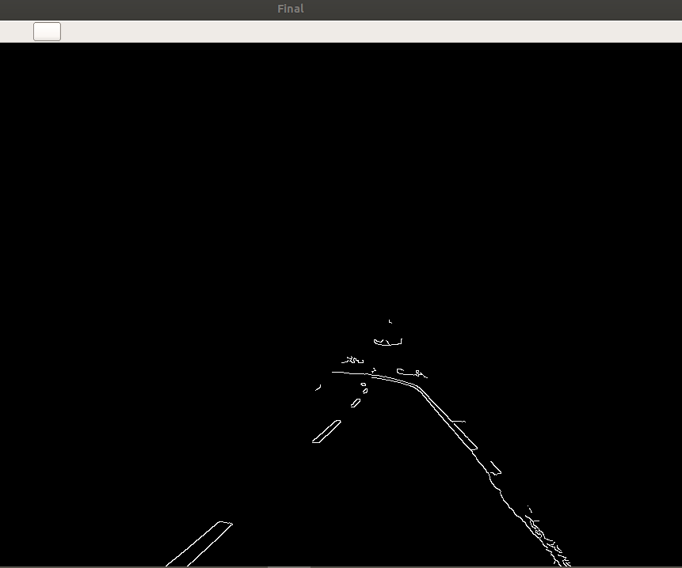
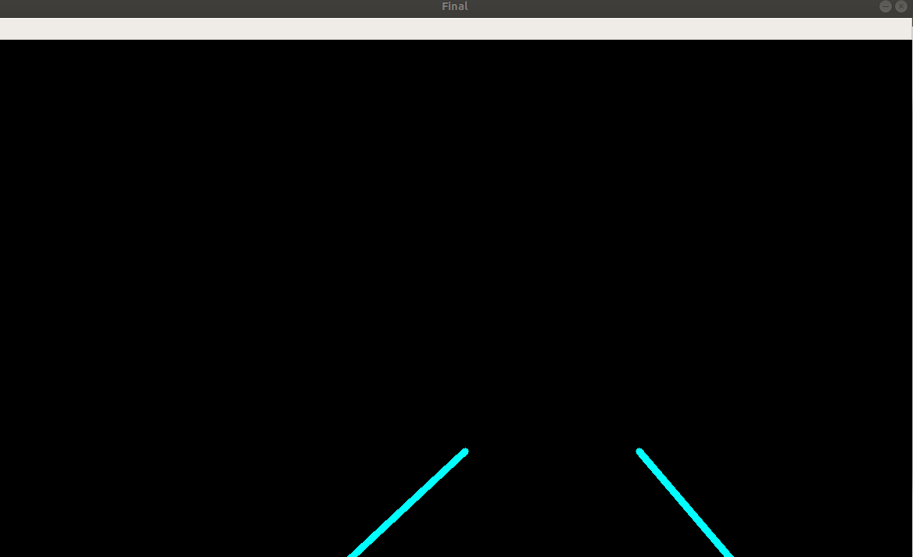
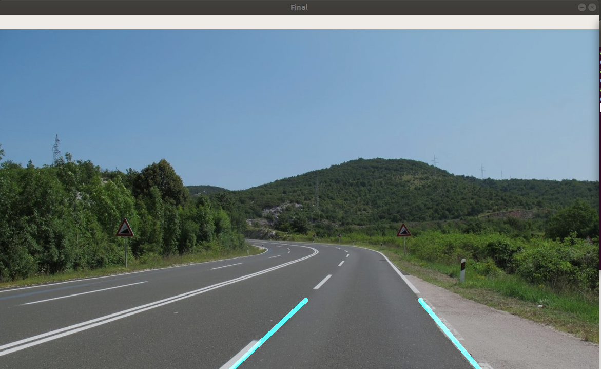

# OpenCV_Lanedetection _Autonomous Driving

In this project, I used to detect roadlanes from an image or a video by using OpenCV and also using Hough line transform algorithm

# Line detection

# Choosing the region of interest

# Drawing straight line

# Merging with actual RGB image

